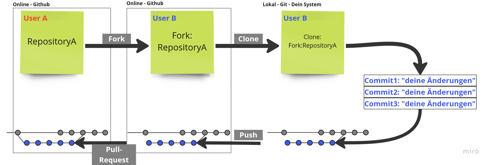

# anleitung um einen fork zu erstellen zu clonen und eine pull-request zu erstellen


1. **Fork erstellen:**
   - Gehe auf die GitHub-Seite des Repositories, das du forken möchtest.
   - Klicke oben rechts auf den "Fork"-Button.

2. **Repository lokal klonen:**
   - Öffne ein Terminal oder eine Git-Bash.
   - Klone dein geforktes Repository:
     ```bash
     git clone https://github.com/dein-benutzername/repository-name.git
     ```
   - Wechsel in das Verzeichnis des geklonten Repositories:
     ```bash
     cd repository-name
     ```

3. **Änderungen vornehmen:**
   - Führe deine Änderungen durch und speichere sie.
   - Füge die Änderungen zur Staging-Area hinzu:
     ```bash
     git add .
     ```
   - Committe deine Änderungen:
     ```bash
     git commit -m "Kurze Beschreibung der Änderungen"
     ```

4. **Branch zu GitHub pushen:**
   - Push den neuen Branch zu deinem Fork auf GitHub:
     ```bash
     git push
     ```


5. **Pull Request erstellen:**
   - Gehe zu deinem geforkten Repository auf GitHub.
   - Klicke auf "Compare & pull request".
   - Überprüfe die Änderungen und klicke auf "Create pull request".

